# clcharts

`clcharts` is an R package for making charts in the House of Commons Library style with `ggplot2`. It includes themes, scales, colors, and a set of helper functions for easily composing attractive charts that conform to the house style.

The documentation that follows is divided into four broad sections:

1. [Setup](#setup)
2. [Usage](#usage)
3. [Recipes](#recipes)
4. [Reference](#reference)

Some of the material shown in Sections 2 and 3 will be familiar to experienced R users. It is included to help newer R users who are still learning how to work with ggplot. These sections do not provide a complete introduction to working with ggplot, but they will help you understand how to use the `clcharts` package in practice, and show you how to make some of the most frequently used charts in the House of Commons Library style. Even experienced users should take note of the conventions used to adhere to the style guidance when using R. `clcharts` is designed to make this easier and provides some helper functions that will save you time.

For a detailed introduction to using `ggplot2` see Chapter 3 of *R for Data Science* on [Data visualisation](https://r4ds.had.co.nz/data-visualisation.html).

---

## Setup

### Installation

Install from GitHub using remotes.

``` r
install.packages("remotes")
remotes::install_github("olihawkins/clcharts")
```

### Fonts

The House of Commons Library chart style uses licensed fonts that are not distributed with the `clcharts` package. Instead, a font pack is separately available for Library users. This is a small folder of the required font files, which should be copied into your home directory with the folder name `.clcharts`.

The location of your home directory will depend on your operating system. To find out the location of the directory where `clcharts` will expect to find the font pack folder, type the following into your R console:

```r
Sys.getenv("HOME")
```

Copy the `.clcharts` folder into your home directory and `clcharts` will automatically import the font files whenever the package loads.

### Importing

Once the package and the font pack have both been installed, you can import the package into your R session or script with:

```
library(clcharts)
```

---

## Usage

### Basic plotting workflow

`ggplot2` is a powerful and flexible plotting library. There are lots of ways you can combine its functions to achieve different results, but most plotting code involves the following steps:

- Use the `ggplot` function to specify your data and how it relates to the plot
- Use a `geom` function to say how your data will be represented (lines, bars, points etc.)
- Use the `labs` function to set labels for the plot elements (title, subtitle, axis titles, caption etc.)
- Use `scale_x` and `scale_y` functions to configure the axis settings (limits, labels, breaks etc.)
- Use a `theme` function to set the overall style of the plot

Here is an example of how to make a simple line chart using the Commons Library theme in `clcharts`. This theme is called `theme_commonslib`. When using ggplot functions, the plus sign means "add this modification to the plot", so you use the plus sign to combine a series of modifications to the plot's default settings.

```r
# Load the packages: tidyverse includes ggplot2
library(tidyverse)
library(clcharts)

# Set the random seed to make the output reproducible
set.seed(2001)

# Create some random data to plot
df <- tibble(
    time = 1:10,
    value = time + 5 + rnorm(10))

# Use the ggplot function to set up the plot with the data
plot <- ggplot(
        # Specify that df contains the data
        data = df,
        # Use aes to map time to the x axis and value to the y axis
        mapping = aes(x = time, y = value)) +

    # Use the geom_line function to indicate the data should be drawn as a line
    geom_line(color = "#006548", size = 1.1) +

    # Use the labs function to set the title, subtitle, and axis titles
    labs(
        title = "Something has increased",
        subtitle = "The value of something over time",
        x = "Time",
        y = "Value") +

    # Use scale_x and scale_y functions to control each axis
    scale_x_continuous(breaks = seq(0, 10, 2)) +
    scale_y_continuous(limits = c(0, 20)) +

    # Use the theme_commonslib function to set the plot style
    theme_commonslib()

# Save the plot
save_png(plot, "ggplot-basics-1.png", width = 8, height = 5)
```

This code will create the following plot in the Commons Library style. This plot is not finished. There are further modifications we need to make before it fully adheres to the style guide. But this shows the basic workflow of making a plot with `ggplot2`.

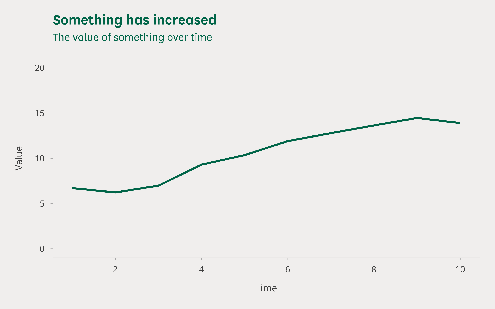

### Plotting with clcharts

`clcharts` adds one more step to the basic plotting workflow: using the `add_commonslib_titles` function to add titles to a plot.

In the above example we added a title by using the `labs` function. This is the standard method for setting titles and subtitles in `ggplot2` and it gives you the title alignment you see in the example, with the titles aligned to the left-hand edge of the plotting area. 

In the House of Commons Library style the titles should be aligned to the left-hand edge of the y axis. To make this easy, `clcharts` provides a function called `add_commonslib_titles`, which will give you fully left-aligned titles and subtitles consistent with the package theme.

Create the plot *without* setting the title and subtitle in `labs`.

```r
# Don't set the title and subtitle in the labs function
labs(
    x = "Time",
    y = "Value") +
```

Add the title and subtitle afterwards using `add_commonslib_titles`.

```r
# Add a title and subtitle with add_commonslib_titles
plot <- add_commonslib_titles(
    plot,
    title = "The price has increased over time",
    subtitle = "Value of Some Stock since launch")
```

Making these changes will give you a plot with the correct title formatting, like this.

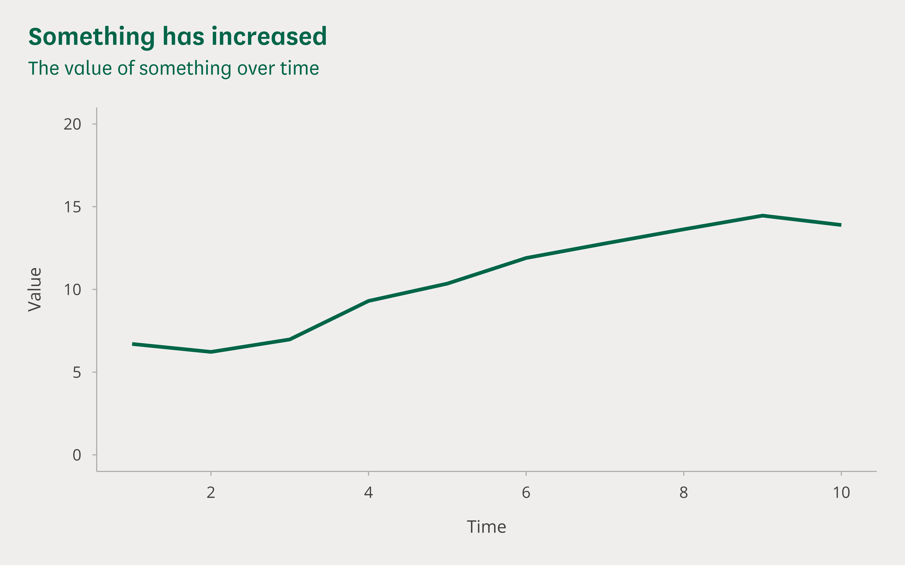

### Colors

In the example line chart above we set the color for the line by specifying the RGB code of the main Commons Library green. Rather than looking up color codes every time you need to make a plot, `clcharts` provides a function called `commonslib_color` that lets you look up colors by name. In the previous example you would use it like this when setting the color in `geom_line`.

```r
# Set the color in geom_line using commonslib_color
geom_line(color = commonslib_color("commons_green"), size = 1.1) +
```

The names of the colors that are available with `commonslib_color` are:

- commons_green
- ocean_green
- pine_green
- grape
- lilac
- tangerine
- cerulean_blue
- pacific_blue
- burnt_orange
- cherry

A separate function called `commonslib_party_color` is available for the colors of political parties. The names of the colors that are available with `commonslib_party_color` are:

- conservative
- labour
- lib_dem
- ukip
- brexit
- green
- snp
- snp_alt
- plaid_cymru
- dup
- dup_alt
- sinn_fein
- uup
- sdlp
- alliance
- other

You can use `commonslib_color` and `commonslib_party_color` to map the colors to different groups in your data using `scale_color_manual` and `scale_fill_manual`. We didn't shade the data by group in the basic example shown above as there weren't any groups, but you can see some examples of this in the recipes below. Have a look at the [Stacked Column Chart](#stacked-column-chart) and the [Line Chart](#line-chart) to see how to use these functions to map colors to groups in your data.

---

## Recipes

The following recipes provide examples of how to create different common chart types with `clcharts`. The datasets for each of these recipes can be found in the [examples/recipes](examples/recipes) folder of this repo.

### Horizontal Bar Chart

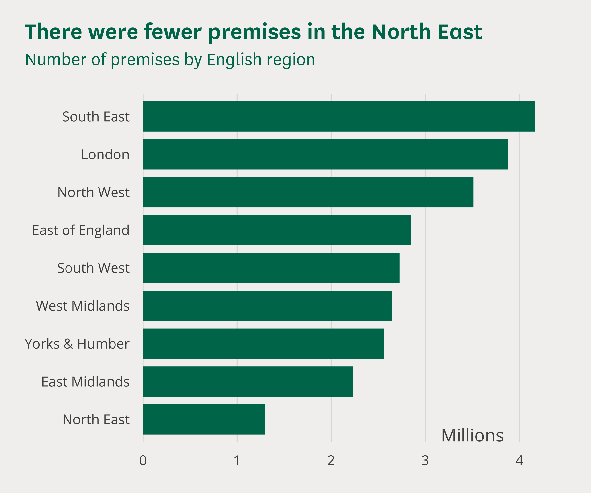

A simple horizontal bar chart:

- Use `geom_col` to represent values with bars
- Set `expand` to `c(0, 0)` in `scale_y_continuous` to turn off padding on the y axis
- Use `coord_flip` to flip the bars from pointing updwards to pointing sideways
- Use `annotate_commonslib` to add the "Millions" label with the right font

```r
# Imports ---------------------------------------------------------------------

library(tidyverse)
library(clcharts)

# Read in and prepare the data ------------------------------------------------

# Load the data from the csv as a dataframe
df <- read_csv("bar-chart-annotations.csv")

# Turn the region column into a factor and order it by the number of premises
# in each region: this sorts the bars in the chart from largest to smallest
df$region <- factor(df$region)
df$region <- reorder(df$region, df$premises)

# Divide premises by one million to get the value in millions
df$premises = df$premises / 1000000

# Create the plot -------------------------------------------------------------

# Use ggplot to create a plot with data and mappings
plot <- ggplot(
    data = df,
    mapping = aes(x = region, y = premises)) +
    # Add a col geometry for columns: use width = 0.8 to match house style;
    # geom_col will plot the values for each region;
    # we set the fill color in geom_bar as color does not represent data
    geom_col(
        width = 0.8,
        fill = commonslib_color("commons_green")) +
    # Set labels for the axes, legend, and caption: DON'T set titles here
    labs(
        x = NULL,
        y = NULL) +
    # Configure the the x and y axes: we set the y axis breaks and limits, and
    # we turn off the y-axis expansion
    scale_x_discrete() +
    scale_y_continuous(
        limits = c(0, 4.5),
        breaks = seq(0, 4, 1),
        expand = c(0,0)) +
    # Use the coord_flip function to flip the axes: this will turn a vertical
    # column chart into a horizontal bar chart
    coord_flip() +
    # Use annotate_commonslib to add annotations to a plot: this function does
    # the same thing as annotate but it automatically sets the fonts to match
    # the house style; position each annotation using values on the axis scales
    annotate_commonslib(
        x = 0.58,
        y = 3.5,
        label = "Millions",
        size = 4.5) +
    # Add the Commons Library theme: we turn off the axes and set gridlines to
    # vertical
    theme_commonslib(
        axes = "",
        grid = "v")

# After creating the plot, add a title and subtitle with add_commonslib_titles
plot <- add_commonslib_titles(
    plot,
    title = "There were fewer premises in the North East",
    subtitle = "Number of premises by English region")

# Save the plot in different formats ------------------------------------------

# Save a high resolution export of the plot as a png
save_png(
    "bar-chart-annotations.png",
    plot = plot,
    width = 6,
    height = 5)

# Save an editable verson of the plot as an svg
save_svg(
    "bar-chart-annotations.svg",
    plot = plot,
    width = 6,
    height = 5)
```

### Vertical Column Chart

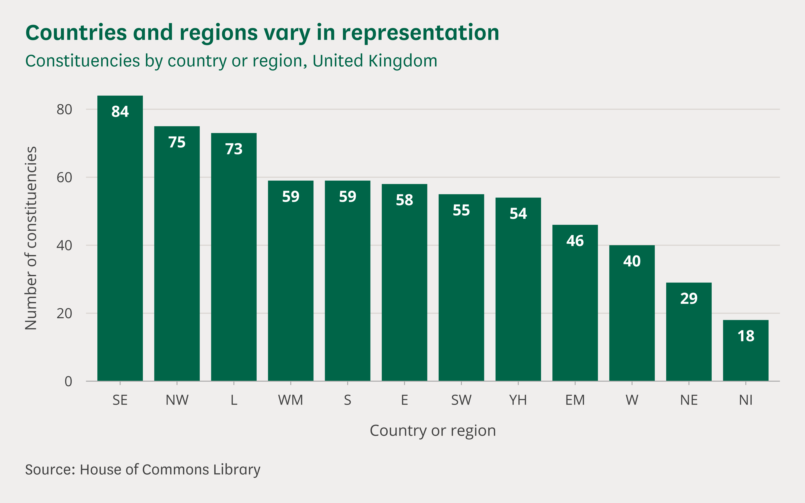

A vertical column chart with labels:

- Use `geom_bar` to represent the number of items in each group with bars
- Use `geom_text_commonslib` to add the text labels in the correct font
- Set `expand` to `c(0, 0)` in `scale_y_continuous` to turn off padding on the y axis
- Set a caption in `labs` and set its position in `theme_commonslib`

```r
# Imports ---------------------------------------------------------------------

library(tidyverse)
library(clcharts)

# Read in and prepare the data ------------------------------------------------

# Load the data from the csv as a dataframe
df <- read_csv("column-chart-labels.csv")

# Turn the region column into a factor and order it by the number of items in
# each region: this sorts the columns in the chart from largest to smallest
df$region <- factor(df$region)
df$region <- fct_rev(reorder(df$region, df$region, length))

# Create the plot -------------------------------------------------------------

# Use ggplot to create a plot with data
plot <- ggplot(data = df) +
    # Add a bar geometry for columns: use width = 0.8 to match house style;
    # geom_bar will plot the number of items in each category;
    # we set the fill color in geom_bar as color does not represent data
    geom_bar(
        mapping = aes(x = region),
        width = 0.8,
        fill = commonslib_color("commons_green")) +
    # Add a text geometry for labels: geom_text_commonslib uses the right fonts
    geom_text_commonslib(
        mapping = aes(x = region, label = ..count..),
        stat = "count",
        vjust = "top",
        nudge_y = -3) +
    # Set labels for the axes and caption: DON'T set titles here
    labs(
        x = "Country or region",
        y = "Number of constituencies",
        caption = "Source: House of Commons Library") +
    # Configure the the x and y axes: we remove the expansion for the y axis
    scale_x_discrete() +
    scale_y_continuous(expand = c(0,0)) +
    # Add the Commons Library theme: we set a bottom axis, horizontal
    # gridlines, and set the caption on the left
    theme_commonslib(
        axes = "b",
        grid = "h",
        caption_position = "left")

# After creating the plot, add a title and subtitle with add_commonslib_titles
plot <- add_commonslib_titles(
    plot,
    title = "Countries and regions vary in representation",
    subtitle = "Constituencies by country or region, United Kingdom")

# Save the plot in different formats ------------------------------------------

# Save a high resolution export of the plot as a png
save_png(
    "column-chart-labels.png",
    plot = plot,
    width = 8,
    height = 5)

# Save an editable verson of the plot as an svg
save_svg(
    "column-chart-labels.svg",
    plot = plot,
    width = 8,
    height = 5)
```

### Stacked Column Chart

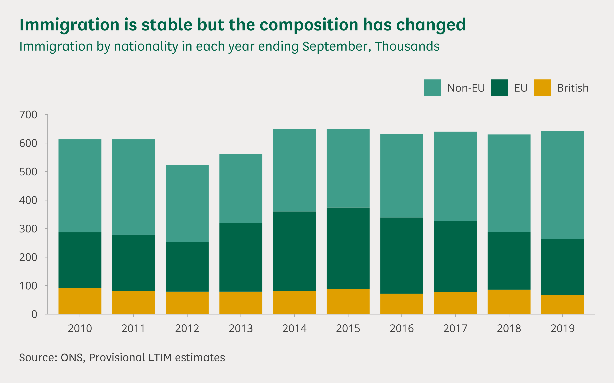

A stacked column chart with a legend:

- Use `geom_col` to represent values with bars
- Map `nationality` to `fill` in `aes` to color each nationality group differently
- Set `fill` to `NULL` in `labs` to turn off the legend title
- Set `legend_position` to `top-right` in `theme_commonslib`
- Use `scale_fill_manual` and `commonslib_color` to map a theme color to each group

```r
# Imports ---------------------------------------------------------------------

library(tidyverse)
library(clcharts)

# Read in and prepare the data ------------------------------------------------

# Load the data from the csv as a dataframe
df <- read_csv("stacked-column-chart.csv")

# Convert the year to character data: we don't want to treat this as a date or
# a number in this case, it is just a label for each bar
df$year <- as.character(df$year)

# Turn the nationality column into a factor: setting the order of the levels
# controls the order of the categories in each bar from top to bottom
df$nationality <- factor(df$nationality, levels = c("Non-EU", "EU", "British"))

# Create the plot -------------------------------------------------------------

# Use ggplot to create a plot with data and mappings
plot <- ggplot(
        data = df,
        mapping = aes(x = year, y = estimate, fill = nationality)) +
    # Add a col geometry for columns: use width = 0.8 to match house style;
    # geom_col will plot the values for each category
    geom_col(width = 0.8) +
    # Set labels for the axes, legend, and caption: DON'T set titles here
    labs(
        x = NULL,
        y = NULL,
        fill = NULL,
        caption = "Source: ONS, Provisional LTIM estimates") +
    # Configure the the x and y axes: we set the y axis breaks and limits, and
    # we turn off the y-axis expansion
    scale_x_discrete() +
    scale_y_continuous(
        limits = c(0, 700),
        breaks = seq(0, 700, 100),
        expand = c(0,0)) +
    # Add the Commons Library theme: we don't specify settings for the axes and
    # grid which means we are using the defaults; we set the legend and caption
    # positions
    theme_commonslib(
        legend_position = "top-right",
        caption_position = "left") +
    # Use scale_fill_manual and commonslib_color to set category colors
    scale_fill_manual(values = c(
        "British" = commonslib_color("tangerine"),
        "EU" = commonslib_color("commons_green"),
        "Non-EU" = commonslib_color("ocean_green")))

# After creating the plot, add a title and subtitle with add_commonslib_titles
plot <- add_commonslib_titles(
    plot,
    title = "Immigration is stable but the composition has changed",
    subtitle = "Immigration by nationality in each year ending September, Thousands")

# Save the plot in different formats ------------------------------------------

# Save a high resolution export of the plot as a png
save_png(
    "stacked-column-chart.png",
    plot = plot,
    width = 8,
    height = 5)

# Save an editable verson of the plot as an svg
save_svg(
    "stacked-column-chart.svg",
    plot = plot,
    width = 8,
    height = 5)

```

### Line Chart

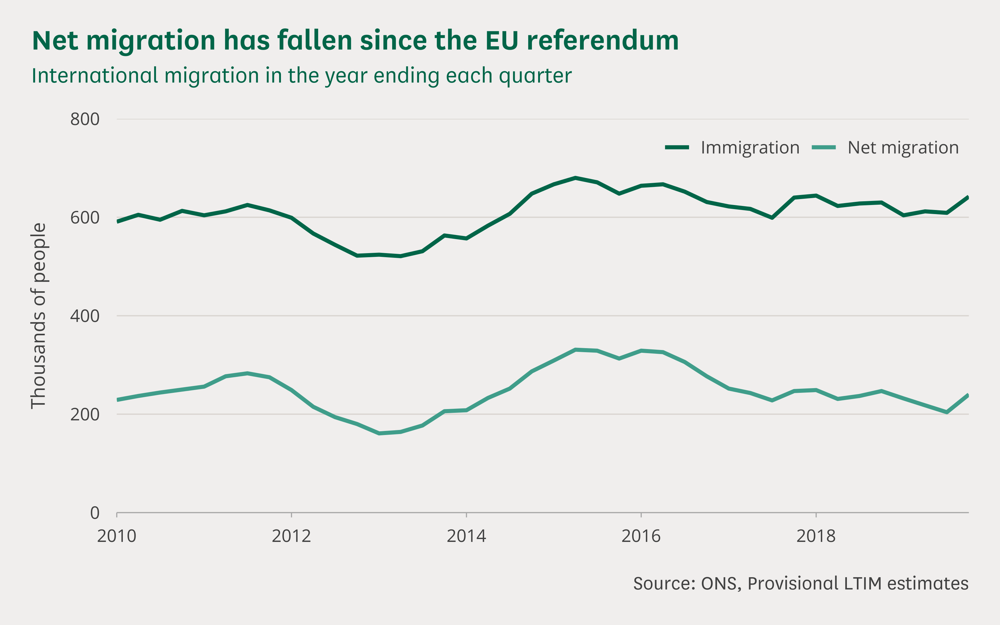

A line chart with two groups and a legend:

- Map `flow` to `color` in `aes` to color each flow group differently
- Set `color` to `NULL` in `labs` to turn off the legend title
- Set `expand` to `c(0, 0)` in both axis scales to turn off axis padding
- Use `scale_color_manual` and `commonslib_color` to map a theme color to each group
- Use an additional `theme` customisation to overlay the legend on the plot

```r
# Imports ---------------------------------------------------------------------

library(tidyverse)
library(clcharts)

# Read in and prepare the data ------------------------------------------------

# Load the data from the csv as a dataframe
df <- read_csv("line-chart.csv")

# Create the plot -------------------------------------------------------------

# Use ggplot to create a plot with data and mappings
plot <- ggplot(
        data = df,
        mapping = aes(x = quarter, y = estimate, color = flow)) +
    # Add a line geometry to draw lines: use size = 1.1 to match house style
    geom_line(size = 1.1) +
    # Set labels for the axes, legend, and caption: DON'T set titles here
    labs(
        color = NULL,
        x = NULL,
        y = "Thousands of people",
        caption = "Source: ONS, Provisional LTIM estimates") +
    # Configure the the x and y axes: we set the y axis breaks and limits
    scale_x_date(
        expand = c(0, 0)) +
    scale_y_continuous(
        breaks = seq(0, 800, 200),
        limits = c(0, 800),
        expand = c(0, 0)) +
    # Add the Commons Library theme: bottom axis and horizontal gridlines
    theme_commonslib(
        axes = "b",
        grid = "h") +
    # Use scale_color_manual and commonslib_color to set colors for each lines
    scale_color_manual(values = c(
        "Immigration" = commonslib_color("commons_green"),
        "Net migration" = commonslib_color("ocean_green"))) +
    # Here we use a theme customisation to overlay the legend on the plot area:
    # We could have used legend_position = "top-right" in theme_commonslib
    # to put the legend at the top-right above the plot area
    theme(
        legend.position = c(1, 0.99),
        legend.justification = c(1, 1),
        legend.direction = "horizontal")

# After creating the plot, add a title and subtitle with add_commonslib_titles
plot <- add_commonslib_titles(
    plot,
    title = "Net migration has fallen since the EU referendum",
    subtitle = "International migration in the year ending each quarter")

# Save the plot in different formats ------------------------------------------

# Save a high resolution export of the plot as a png
save_png(
    "line-chart.png",
    plot = plot,
    width = 8,
    height = 5)

# Save an editable verson of the plot as an svg
save_svg(
    "line-chart.svg",
    plot = plot,
    width = 8,
    height = 5)
```

### Area Chart


An area chart with annotations:

- Import the `scales` package for formatting axis labels
- Use `geom_area` to represent values with shaded areas
- Set `label` to `comma` in scale_y_continuous to add comma formatting
- Use `annotate_commonslib` to add the group labels with the right font

```r
# Imports ---------------------------------------------------------------------

library(tidyverse)
library(scales)
library(clcharts)

# Read in and prepare the data ------------------------------------------------

# Load the data from the csv as a dataframe and pivot it into a tidy format
df <- read_csv("area-chart-annotations.csv") %>%
    pivot_longer(
        cols = -date,
        names_to = "care_setting",
        values_to = "number")

# Turn the care_setting column into a factor: setting the order of the levels
# controls the order of the categories from top to bottom
df$care_setting <- factor(df$care_setting, levels = c("neonatal", "maternity"))

# Create the plot -------------------------------------------------------------

# Use ggplot to create a plot with data and mappings
plot <- ggplot(
        data = df,
        mapping = aes(x = date, y = number, fill = care_setting)) +
    # Add an area geometry to fill areas based on the data
    geom_area() +
    # Set labels for the axes: DON'T set titles here
    labs(
        x = NULL,
        y = NULL) +
    # Configure the the x and y axes: we set the y axis breaks and limits, and
    # we turn off the expansion on both axes
    scale_x_date(
        expand = c(0, 0)) +
    scale_y_continuous(
        label = comma,
        limits = c(0, 9000),
        breaks = seq(0, 9000, 3000),
        expand = c(0, 0)) +
    # Use annotate_commonslib to add annotations to a plot: this function does
    # the same thing as annotate but it automatically sets the fonts to match
    # the house style; position each annotation using values on the axis scales
    annotate_commonslib(
        x = as.Date("2015-01-01"),
        y = 5500,
        label = "Neonatal nurses",
        color = "#202020",
        hjust = 0) +
    annotate_commonslib(
        x = as.Date("2015-01-01"),
        y = 1500,
        label = "Maternity nurses",
        color = "#ffffff",
        hjust = 0) +
    # Add the Commons Library theme: we use the default axes settings, set
    # gridlines to horizontal, and turn off the legend
    theme_commonslib(
        grid = "h",
        legend_position = "none") +
    # Use scale_fill_manual and commonslib_color to set category colors
    scale_fill_manual(values = c(
        "neonatal" = commonslib_color("ocean_green"),
        "maternity" = commonslib_color("commons_green")))

# After creating the plot, add a title and subtitle with add_commonslib_titles
plot <- add_commonslib_titles(
    plot,
    title = "Neonatal nurses have overtaken maternity nurses",
    subtitle = "Maternity and neonatal nurses in England")

# Save the plot in different formats ------------------------------------------

# Save a high resolution export of the plot as a png
save_png(
    "area-chart-annotations.png",
    plot = plot,
    width = 8,
    height = 5)

# Save an editable verson of the plot as an svg
save_svg(
    "area-chart-annotations.svg",
    plot = plot,
    width = 8,
    height = 5)
```

### Scatter Chart

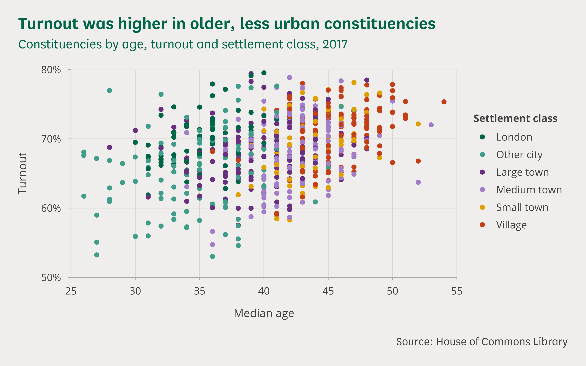

A scatter chart with points shaded by a categorical variable:

- Import the `scales` package for formatting axis labels
- Use `geom_point` to represent values with shaded areas
- Set `shape` to `16` in `geom_point` to get a points without borders
- Set `label` to `percent_format(accuracy = 1)` in `scale_y_continuous` to format percentages

In practice you probably wouldn't want to use all of these colours at the same time in a single scatter chart. Faceting the groups may be more appropriate (see the next recipe for an example).

```r
# Imports ---------------------------------------------------------------------

library(tidyverse)
library(scales)
library(clcharts)

# Read in and prepare the data ------------------------------------------------

# Load the data from the csv as a dataframe
df <- read_csv("scatter-chart.csv")

# Turn the classification column into a factor: setting the order of the levels
# controls the order of the categories in the legend from top to bottom
settlement_classes <- c(
    "London",
    "Other city",
    "Large town",
    "Medium town",
    "Small town",
    "Village")

df$classification <- factor(df$classification, levels = settlement_classes)

# Create the plot -------------------------------------------------------------

# Use ggplot to create a plot with data and mappings
plot <- ggplot(
        data = df,
        mapping = aes(x = median_age, y = turnout, color = classification)) +
    # Add a point geometry to add points: set shape = 16 to match house style
    geom_point(
        shape = 16,
        size = 2) +
    # Set labels for the axes, colors and caption: DON'T set titles here
    labs(
        x = "Median age",
        y = "Turnout",
        color = "Settlement class",
        caption = "Source: House of Commons Library") +
    # Configure the the x and y axes: set the x axis limits,; set the y axis
    # limits and the y axis labels to show percentages to the nearest percent,
    # turn off the expansion on both axes
    scale_x_continuous(
        limits = c(25, 55),
        expand = c(0, 0)) +
    scale_y_continuous(
        limits = c(0.5, 0.8),
        label = percent_format(accuracy = 1),
        expand = c(0, 0)) +
    # Add the Commons Library theme: we use the default axes settings and set
    # the gridlines to both horizontal and vertical
    theme_commonslib(grid = "hv") +
    # Use scale_color_manual and commonslib_color to set category colors
    scale_color_manual(values = c(
        "London" = commonslib_color("commons_green"),
        "Other city" = commonslib_color("ocean_green"),
        "Large town" = commonslib_color("grape"),
        "Medium town" = commonslib_color("lilac"),
        "Small town" = commonslib_color("tangerine"),
        "Village" = commonslib_color("burnt_orange")))

# After creating the plot, add a title and subtitle with add_commonslib_titles
plot <- add_commonslib_titles(
    plot,
    title = "Turnout was higher in older, less urban constituencies",
    subtitle = "Constituencies by age, turnout and settlement class, 2017")

# Save the plot in different formats ------------------------------------------

# Save a high resolution export of the plot as a png
save_png(
    "scatter-chart.png",
    plot = plot,
    width = 8,
    height = 5)

# Save an editable verson of the plot as an svg
save_svg(
    "scatter-chart.svg",
    plot = plot,
    width = 8,
    height = 5)
```

### Faceted Scatter Chart

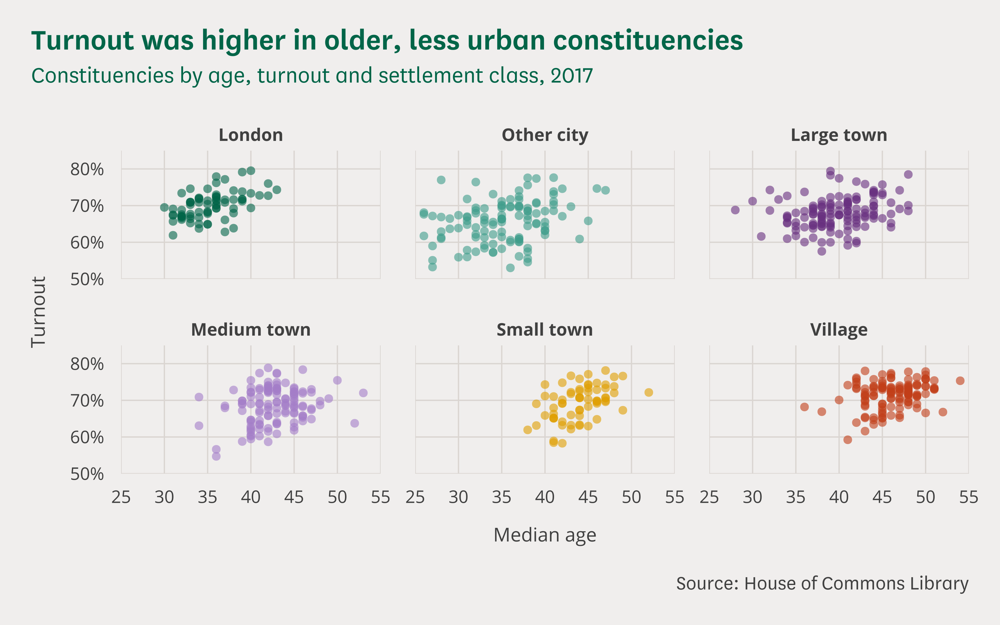

A scatter chart faceted by a categorical variable:

- Use `geom_point` to represent values with shaded areas
- Set `shape` to `16` in `geom_point` to get a points without borders
- Set `alpha` to `0.6` in `geom_point` to increase transparency of the points
- Use `facet_wrap` to plot a different chart for each category in a variable

```r
# Imports ---------------------------------------------------------------------

library(tidyverse)
library(scales)
library(clcharts)

# Read in and prepare the data ------------------------------------------------

# Load the data from the csv as a dataframe
df <- read_csv("scatter-chart-facets.csv")

# Turn the classification column into a factor: setting the order of the levels
# controls the order of the categories in the legend from top to bottom
settlement_classes <- c(
    "London",
    "Other city",
    "Large town",
    "Medium town",
    "Small town",
    "Village")

df$classification <- factor(df$classification, levels = settlement_classes)

# Create the plot -------------------------------------------------------------

# Use ggplot to create a plot with data and mappings
plot <- ggplot(
        data = df,
        mapping = aes(x = median_age, y = turnout, color = classification)) +
    # Add a point geometry to add points: set shape = 16 to match house style
    geom_point(
        shape = 16,
        size = 2,
        alpha = 0.6) +
    # Use facet_wrap to set the variable to facet with
    facet_wrap(~ classification) +
    # Set labels for the axes, colors and caption: DON'T set titles here
    labs(
        x = "Median age",
        y = "Turnout",
        color = "Settlement class",
        caption = "Source: House of Commons Library") +
    # Configure the the x and y axes: set the x axis limits,; set the y axis
    # limits and the y axis labels to show percentages to the nearest percent,
    # turn off the expansion on both axes
    scale_x_continuous(
        limits = c(25, 55),
        expand = c(0, 0)) +
    scale_y_continuous(
        limits = c(0.5, 0.85),
        label = percent_format(accuracy = 1),
        expand = c(0, 0)) +
    # Add the Commons Library theme: we turn off the axes, set the gridlines to
    # both horizontal and vertical, and turn off the legend
    theme_commonslib(
        axes = "",
        grid = "hv",
        legend_position = "none") +
    # Use scale_color_manual and commonslib_color to set category colors
    scale_color_manual(values = c(
        "London" = commonslib_color("commons_green"),
        "Other city" = commonslib_color("ocean_green"),
        "Large town" = commonslib_color("grape"),
        "Medium town" = commonslib_color("lilac"),
        "Small town" = commonslib_color("tangerine"),
        "Village" = commonslib_color("burnt_orange")))

# After creating the plot, add a title and subtitle with add_commonslib_titles
plot <- add_commonslib_titles(
    plot,
    title = "Turnout was higher in older, less urban constituencies",
    subtitle = "Constituencies by age, turnout and settlement class, 2017")

# Save the plot in different formats ------------------------------------------

# Save a high resolution export of the plot as a png
save_png(
    "scatter-chart-facets.png",
    plot = plot,
    width = 8,
    height = 5)

# Save an editable verson of the plot as an svg
save_svg(
    "scatter-chart-facets.svg",
    plot = plot,
    width = 8,
    height = 5)
```

### Smoothed Ridge Chart

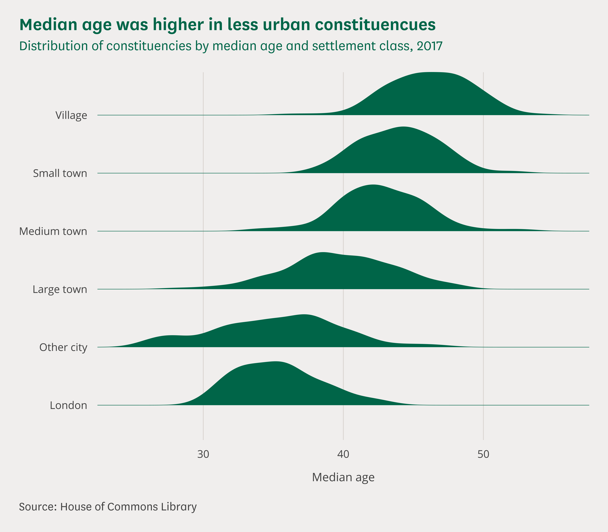

A smoothed ridge chart - you will need to install the `ggridges` package with `install.packages("ggridges")` to make this chart:

- Import the `ggridges` package for making ridge charts
- Use `geom_density_ridges` to represent data as a histogram
- Set `scale` to `0.8` in `geom_density_ridges` to stop the ridges overlapping
- Use `coord_cartesian(clip = "off")` to stop the top ridge getting clipped

```r
# Imports ---------------------------------------------------------------------

library(tidyverse)
library(ggridges)
library(clcharts)

# Read in and prepare the data ------------------------------------------------

# Load the data from the csv as a dataframe
df <- read_csv("ridge-chart-smooth.csv")

# Turn the classification column into a factor: setting the order of the levels
# controls the order of the categories in the legend from top to bottom
settlement_classes <- c(
    "London",
    "Other city",
    "Large town",
    "Medium town",
    "Small town",
    "Village")

df$classification <- factor(df$classification, levels = settlement_classes)

# Create the plot -------------------------------------------------------------

# Use ggplot to create a plot with data and mappings
plot <- ggplot(
        data = df,
        mapping = aes(x = median_age, y = classification)) +
    # Add a density ridgeline geometry to create smoothed histograms;
    # scale should be less than one stop bins overlapping;
    # set both fill and color to the same green
    geom_density_ridges(
        fill = commonslib_color("commons_green"),
        color = commonslib_color("commons_green"),
        size = 0.2,
        scale = 0.8) +
    # Set labels for the axes, colors and caption: DON'T set titles here
    labs(
        x = "Median age",
        y = NULL,
        color = "Settlement class",
        caption = "Source: House of Commons Library") +
    # Configure the the x axis only: turn the expansion off
    scale_x_continuous(expand = c(0, 0)) +
    # Use this to stop ggplot clipping the top of the highest ridge
    coord_cartesian(clip = "off") +
    # Add the Commons Library theme: turn off the axes and the legend, and use
    # verical gridlines
    theme_commonslib(
        axes = "",
        grid = "v",
        legend_position = "none",
        caption_position = "left")

# After creating the plot, add a title and subtitle with add_commonslib_titles
plot <- add_commonslib_titles(
    plot,
    title = "Median age was higher in less urban constituencues",
    subtitle = "Distribution of constituencies by median age and settlement class, 2017")

# Save the plot in different formats ------------------------------------------

# Save a high resolution export of the plot as a png
save_png(
    "ridge-chart-smooth.png",
    plot = plot,
    width = 8,
    height = 7)

# Save an editable verson of the plot as an svg
save_svg(
    "ridge-chart-smooth.svg",
    plot = plot,
    width = 8,
    height = 7)
```

### Binned Ridge Chart

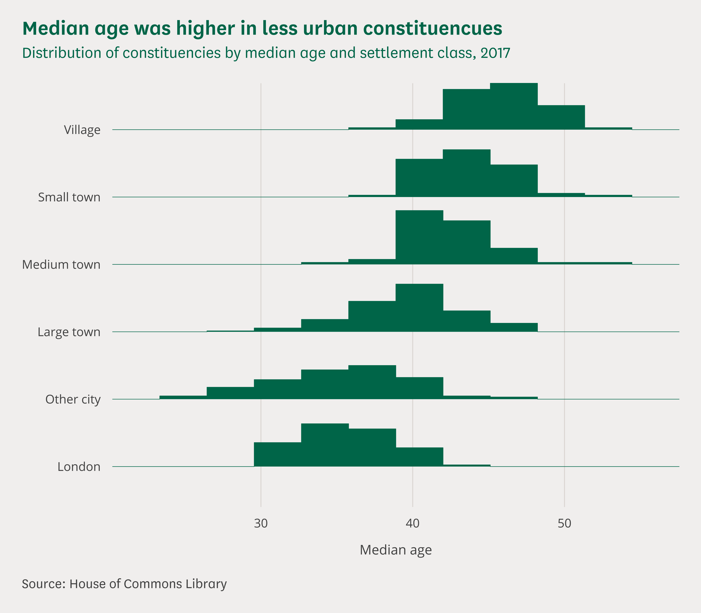

A binned ridge chart - you will need to install the `ggridges` package with `install.packages("ggridges")` to make this chart:

- Import the `ggridges` package for making ridge charts
- Use `geom_density_ridges` to represent data as a histogram
- Set `stat` to `binline` to turn on binning and choose a good value for `bins`
- Set `scale` to `0.8` in `geom_density_ridges` to stop the ridges overlapping
- Use `coord_cartesian(clip = "off")` to stop the top ridge getting clipped

```r
# Imports ---------------------------------------------------------------------

library(tidyverse)
library(ggridges)
library(clcharts)

# Read in and prepare the data ------------------------------------------------

# Load the data from the csv as a dataframe
df <- read_csv("ridge-chart-bins.csv")

# Turn the classification column into a factor: setting the order of the levels
# controls the order of the categories in the legend from top to bottom
settlement_classes <- c(
    "London",
    "Other city",
    "Large town",
    "Medium town",
    "Small town",
    "Village")

df$classification <- factor(df$classification, levels = settlement_classes)

# Create the plot -------------------------------------------------------------

# Use ggplot to create a plot with data and mappings
plot <- ggplot(
        data = df,
        mapping = aes(x = median_age, y = classification)) +
    # Add a density ridgeline geometry to create histograms;
    # set stat = "binline" to use binning, and bins = 10 to set number of bins
    # scale should be less than one stop bins overlapping
    # set both fill and color to the same green
    geom_density_ridges(
        fill = commonslib_color("commons_green"),
        color = commonslib_color("commons_green"),
        size = 0.2,
        scale = 0.8,
        stat = "binline",
        bins = 10) +
    # Set labels for the axes, colors and caption: DON'T set titles here
    labs(
        x = "Median age",
        y = NULL,
        color = "Settlement class",
        caption = "Source: House of Commons Library") +
    # Configure the the x axis only: turn the expansion off
    scale_x_continuous(expand = c(0, 0)) +
    # Use this to stop ggplot clipping the top of the highest ridge
    coord_cartesian(clip = "off") +
    # Add the Commons Library theme: turn off the axes and the legend, and use
    # verical gridlines
    theme_commonslib(
        axes = "",
        grid = "v",
        legend_position = "none",
        caption_position = "left")

# After creating the plot, add a title and subtitle with add_commonslib_titles
plot <- add_commonslib_titles(
    plot,
    title = "Median age was higher in less urban constituencues",
    subtitle = "Distribution of constituencies by median age and settlement class, 2017")

# Save the plot in different formats ------------------------------------------

# Save a high resolution export of the plot as a png
save_png(
    "ridge-chart-bins.png",
    plot = plot,
    width = 8,
    height = 7)

# Save an editable verson of the plot as an svg
save_svg(
    "ridge-chart-bins.svg",
    plot = plot,
    width = 8,
    height = 7)
```

### Dumbbell Chart

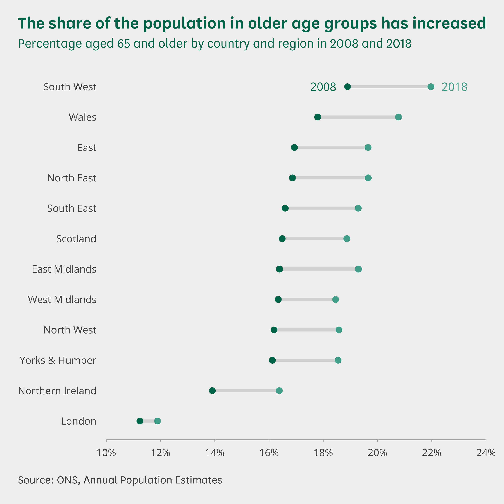

A dumbell chart - you will need to install the `ggalt` package with `install.packages("ggalt")` to make this chart:

- Import the `ggalt` package for making ridge charts
- Use `geom_dumbell` to represent pairs of variables as a dumbbell
- Map variables to `x` and `xend` in `aes` to indicate the paired variables
- Use `annotate_commonslib` to label each variable in the pair with the right font

```r
# Imports ---------------------------------------------------------------------

library(tidyverse)
library(ggalt)
library(scales)
library(clcharts)

# Read in and prepare the data ------------------------------------------------

# Load the data from the csv as a dataframe
df <- read_csv("dumbbell-chart.csv")

# Turn the region column into a factor and order it by the number of premises
#in each region: this sorts the bars in the chart from largest to smallest
df$region <- factor(df$region)
df$region <- reorder(df$region, df$old_age_2008)

# Create the plot -------------------------------------------------------------

# Use ggplot to create a plot with data and mappings
plot <- ggplot(
        data = df,
        mapping = aes(x = old_age_2008, xend = old_age_2018, y = region)) +
     # Add a dumbell geometry to create the dumbells
    geom_dumbbell(
        colour = "#d0d0d0",
        colour_x = commonslib_color("commons_green"),
        colour_xend = commonslib_color("ocean_green"),
        size = 1.5,
        size_x = 2.5,
        size_xend = 2.5) +
    # Set labels for the axes, legend, and caption: DON'T set titles here
    labs(
        x = NULL,
        y = NULL,
        caption = "Source: ONS, Annual Population Estimates") +
    # Configure the the x and y axes: we set the x axis breaks and limits, turn
    # off expansion for the x axis, and format the percetages
    scale_x_continuous(
        limits = c(0.10, 0.24),
        breaks = seq(0.10, 0.24, 0.02),
        expand = c(0,0),
        label = percent_format(accuracy = 1)) +
    scale_y_discrete() +
    # Use annotate_commonslib to add labels to the plot: this function does
    # the same thing as annotate but it automatically sets the fonts to match
    # the house style; position each annotation using values on the axis scales;
    annotate_commonslib(
        x = 0.18,
        y = "South West",
        label = "2008",
        color = commonslib_color("commons_green"),
        size = 4) +
    annotate_commonslib(
        x = 0.2284,
        y = "South West",
        label = "2018",
        color = commonslib_color("ocean_green"),
        size = 4) +
    # Add the Commons Library theme: use just the bottom axis, turn off
    # gridlines and legend, set the caption position to left
    theme_commonslib(
        axes = "b",
        grid = "",
        caption_position = "left")

# After creating the plot, add a title and subtitle with add_commonslib_titles
plot <- add_commonslib_titles(
    plot,
    title = "The share of the population in older age groups has increased",
    subtitle = "Percentage aged 65 and older by country and region in 2008 and 2018")

# Save the plot in different formats ------------------------------------------

# Save a high resolution export of the plot as a png
save_png(
    "dumbbell-chart.png",
    plot = plot,
    width = 7,
    height = 7)

# Save an editable verson of the plot as an svg
save_svg(
    "dumbbell-chart.svg",
    plot = plot,
    width = 7,
    height = 7)
```

---

## Reference

The principal functions that you will use in the `clcharts` package are:

- theme_commonslib
- add_commonslib_titles
- commonslib_color
- commonslib_party_color
- annotate_commonslib
- geom_text_commonslib
- save_svg
- save_png

Type a question mark followed by a function name into the R console to see the full documentation and parameter list for each function. For example, to see all of the parameters you can set in `theme_commonslib` type: 

```r
?theme_commonslib
```
